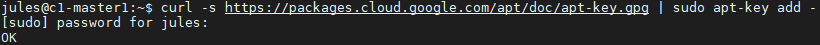
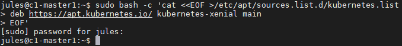
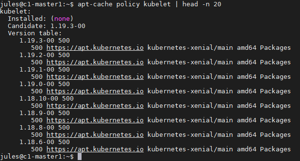
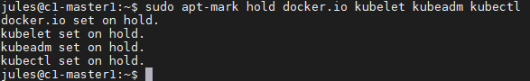
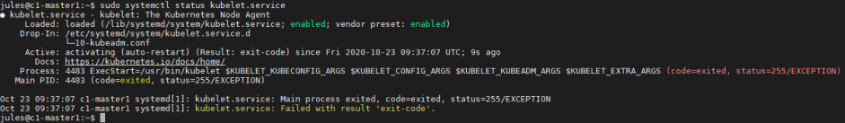
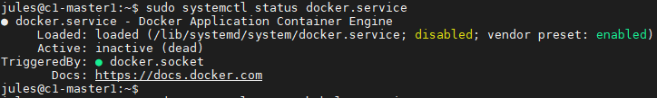
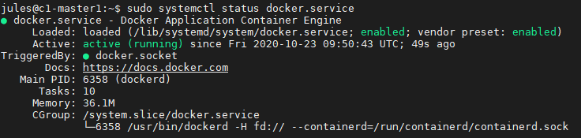

# Getting and Installing Kubernetes on Ubuntu VMs
### Do this on all nodes

## Plan IP des VMs

* c1-master1 192.168.4.100
* c1-node1 192.168.4.101
* c1-node2 192.168.4.102

## Installation de la VM

### Pour chaque VM:

Changer le nom de la machine
```bash
sudo nano /etc/hostname
```

Ajouter les adresees IP de chaque machine dans la Node
```bash
sudo nano /etc/hosts
```
Exemple pour le c1-master1
```bash
127.0.0.1 localhost
127.0.0.1 c1-master1

# Nodes Kubernetes
192.168.4.101 c1-node1
192.168.4.102 c1-node2
```

### Si la VM à été clonnée

Changer l'IP statique de la VM
```bash
sudo nano /etc/netplan/00-installer-config.yaml 
```
Exemple pour le c1-master1
```bash
# This is the network config written by 'subiquity'
network:
    ethernets:
        ens18:
            addresses:
            - 192.168.4.100/24
            gateway4: 192.168.4.1
            nameservers:
                addresses:
                - 8.8.8.8
    version: 2
```

Reboot de la VM
```bash
# Reboot automatique
sudo reboot
# Ou arrêt pour démarrage
sudo poweroff
```
## Installation de Kubernetes
Désactivation du swap
```bash
sudo swapoff -a
```
Et modification du fichier fstab pour empecher de monter le swap lors du boot de la machine
```bash
vi /etc/fstab
```
Ligne à commenter
```bash
# /swap.img     none    swap    sw      0       0
```

Reboot de la VM
```bash
sudo reboot
```

Add Google's gpg key for the apt repository
```bash
curl -s https://packages.cloud.google.com/apt/doc/apt-key.gpg | sudo apt-key add -
```


Add Kubernetes repository to our local repositories lists
```bash
sudo bash -c 'cat <<EOF >/etc/apt/sources.list.d/kubernetes.list
deb https://apt.kubernetes.io/ kubernetes-xenial main
EOF'
```


Refresh the package list
```bash
sudo apt-get update
```

Pour voir les versions disponibles d'un package en particulier
```bash
apt-cache policy kubelet | head -n 20 
apt-cache policy docker.io | head -n 20 
```


Installation des packages
```bash
sudo apt-get install -y docker.io kubelet kubeadm kubectl
```

Blocage de la version des packages
```bash
sudo apt-mark hold docker.io kubelet kubeadm kubectl
```


Il est intéressant de regarder l'état du service Kubelet
```bash
sudo systemctl status kubelet.service
```

Ont peut voir que le service est lancé et est "enabled".

Un code d'erreur à été relevé, c'est normal car le système tourne en boucle 

Faisont de même pour le service Docker
```bash
sudo systemctl status docker.service
```


Ici le service est "disabled" et n'est pas lancé sur la machine. Il faut donc l'activer et le démarrer.

```bash
sudo systemctl enable docker.service
sudo systemctl start docker.service
```


Modification supplémentaires à ajouter à Docker
```bash
sudo bash -c 'cat > /etc/docker/daemon.json <<EOF
{
  "exec-opts": ["native.cgroupdriver=systemd"],
  "log-driver": "json-file",
  "log-opts": {
    "max-size": "100m"
  },
  "storage-driver": "overlay2"
}
EOF'

#Restart reload the systemd config and docker
sudo systemctl daemon-reload
sudo systemctl restart docker

```