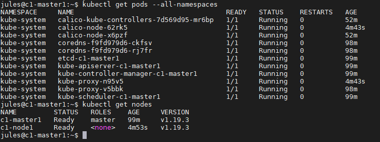

# Creating a Cluster Node
### Dot this only on Node VM

## Lier la Node au Master
Pour lier la node, récupérer la commande fournis lors de l'installation ou récupérer séparément les token de connexion.
```
kubeadm join 192.168.4.100:6443 --token m1e49x.cqm8rh1z0wxx5l16 \
    --discovery-token-ca-cert-hash sha256:b3fcab3064e58b87c9c41d143fbe55d7bded2691a40f39debf246c38f3ffb6a9
```

Une fois la Node ajouté au Cluster. Faire une vérification sur le Master.

Ont peut voir que la Node est bien ajoutée, mais qu'elle n'est pas encore prête.


En attendant un peu, la Node va déployer automatique le "calico pod" et le lancer afin de rejoindre le "Pod Network".



Sur le master nous pouvons voir qu'un nouveau pod c'est lancé 'calico-node-x6pzf'. En refaisant la commande 'get nodes', nous pouvons voir la Node ajouté au Cluster prête.

### Et voilà ! vous avez ajouter une Node à vôtre Cluster 