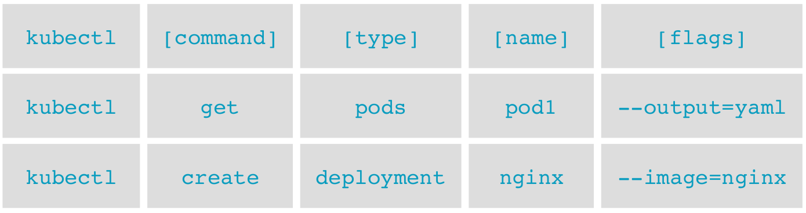

# Use Kubectl

Kubectl (ou kube control) est le CLI de base pour controller les cluster Kubernetes.

Comme chaque actions passe obligatoirement par "l'API Server", cela permet de faire des __Opérations__ sur des __Ressouces__ en sélectionnant un __Format__ de son choix.

## Les opérations basiques
* apply/create - create resoucre(s)
* run - start a pod from an image
* explain - documentation of resources
* delete - delete resource(s)
* get - list resources
* describe - detailed resource information
* exec - execute a command on a container (like docker exec)
* logs - view logs on a container

More info here: https://kubernetes.io/docs/reference/kubectl/overview/#operations

## Les ressources basiques
* Nodes (no)
* Pods (po)
* Services (svc)

Many more here: https://kubernetes.io/docs/reference/kubectl/overview/#resource-types

## Les formats
* wide - output additional info to stdout
* yaml - YAML formatted API object
* json - JSON formatted API object

## How work Kubectl



More info here: https://kubernetes.io/docs/reference/kubectl/kubectl
and here: https://kubernetes.io/docs/reference/kubectl/cheatsheet/

## Basic commands

```bash
# Basic cluster info
kubectl cluster-info 
```

```bash
# Basic status and roles
kubectl get nodes
# Additional information
kubectl get nodes -o wide
```

```bash
# List of pods in the default namespace
kubectl get pods
# List of system pods
kubectl get pods --namespace kube-system
# Additionnal info for each pod
kubectl get pods --namespace kube-system -o wide
```

```bash
# List all
kubectl get all --all-namespaces | more
```

```bash
# api-resources list all the resources available in the cluster
kubectl api-resources
# Limit the number of rows
kubectl api-resources | head -n 10
# Filter easily
kubectl api-resources | grep pod
```

```bash
# Then we can get info on a specific api-resources
kubectl explain pod | more
# You can go deeper
kubectl explain.spec pod | more
kubectl explain.spec.containers pod | more
```

```bash
# It work with alias
kubectl explain no
```

```bash
# Take a closer look at our Nodes
kubectl describe nodes c1-master1
kubectl describe nodes c1-node1
```

## Bash completion
Pour les plus flemmards :smile: (en vrai c'est vraiment pratique)

```bash
sudo apt-get install -y bash-completion
echo "source <(kubectl completion bash)" >> ~/.bashrc
source ~/.bashrc
# Test it
kubectl g[tab][tab] po[tab][tab] --all[tab][tab]
```

```bash
kubectl -h | more
kubectl get -h | more
kubectl describe -h | more
```