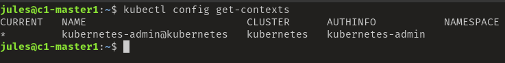

# Kubernetes API & API Server

L'API Serveur est le moyen unique d'accès aux ressouces et aux donnés du data center.

## API Objects
* Collection de primitives qui représentent un état du système
* Active la fonfiguration d'état

Les API objects sont 
* Persistent dans le cluster store
* Représentent l'état actuel du serveur

Les objets sont organisé par:
* kind (string) - Pod, Service, Deployment
* group - core, apps, storage
* version - v1, beta, alpha 

## API Server
* Unique voie pour intéragir avec le cluster
* Unique voie que Kubernetes a pour intéragir avec le cluster

```md
* Client/Server architecture
* RESTful API over HTTP using JSON
* Client submits requests over HTTP/HTTPS
* Server responds to the request
* Stateless
* Serialized and persisted in the cluster store
```

Ces 4 éléments (apiVersion, kind, metadata, specs) sont obligatoire pour définir un manifest.
 ```yaml
 apiVersion: 1
 kind: Pod
 metadata:
    name: nginx-pod
specs:
    containers:
    - name: nginx
      image: nginx
 ```

 Plus d'info ici: https://kubernetes.io/docs/reference/generated/kubernetes-api/v1.19/


 ## Commands

 Pour connaitre le contexte actuel du cluster
 ```bash
 kubectl config get-contexts
 #Change context if needed
 kubectl config use-context kubernetes-admin@kubernetes
 ```

 

 Information concernant l'API Server du context actuel
 ```bash
 kubectl cluster-info
 ```

 Pour plus d'information concernant l'utilisation des commandes de bases voir [Apprendre kubectl](../1_install_&_configuration/4_use_Kubectl.md).