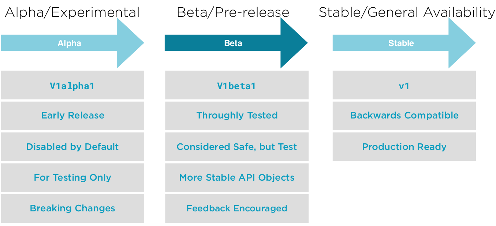
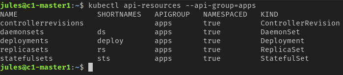
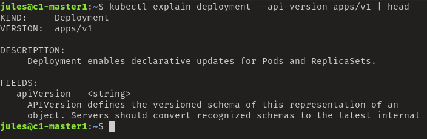
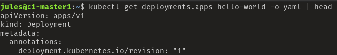

# API Version

* API is versioned
* Provide stability for existing implementations
* Enable forward change
* Alpha -> Beta -> Stable
* No direct relation to release versions

Evolution of an API version


## Commands

```bash
#Get the list of the API resources
kubectl api-resources
#Filter on a specific group
kubectl api-resources --api-group=apps
```


```bash
#Explain command get more information for a specific API Object
#Check out KIND and VERSION
#If VERSION = extensions/v1beta1, the API Group is deprecated
kubectl explain deployment | head
#Get the API Group in a specific version
kubectl explain deployment --api-version apps/v1 | head
```


```bash
#Print the supported API versions on the API Server
kubectl api-versions | sort | more
```

Créer un fichier sur le serveur deployment.yaml et mettez ceci
```yaml
apiVersion: apps/v1
kind: Deployment
metadata:
  name: hello-world
  labels:
    app: hello-world
spec:
  replicas: 4
  selector:
    matchLabels:
      app: hello-world
  template:
    metadata:
      labels:
        app: hello-world
    spec:
      containers:
      - name: hello-world
        image: gcr.io/google-samples/hello-app:1.0
        ports:
        - containerPort: 8080
```

Nous déployons le fichier
```bash
kubectl apply -f deployment.yaml
#Let observ the result
kubectl get deployments.apps hello-world -o yaml | head
```

La version du déploiement est "apps/v1"



```bash
#Let's clean up after this demo
kubectl delete deployment hello-world
```