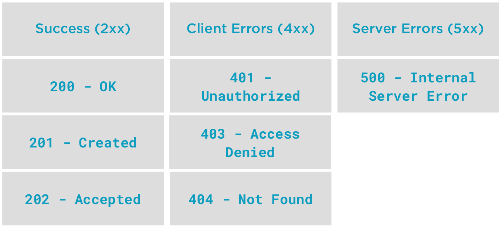
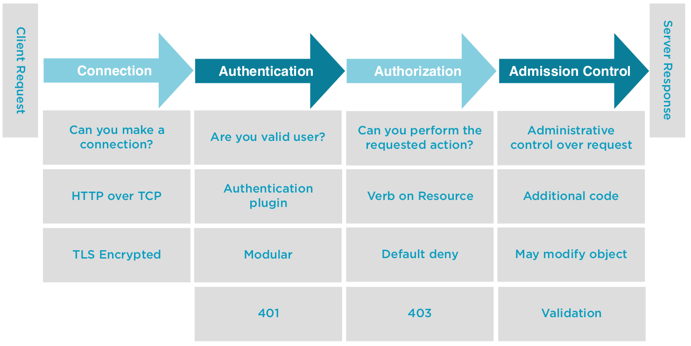
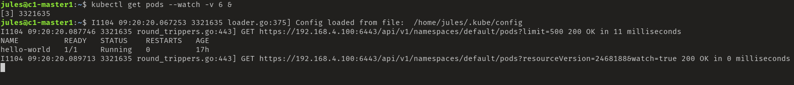
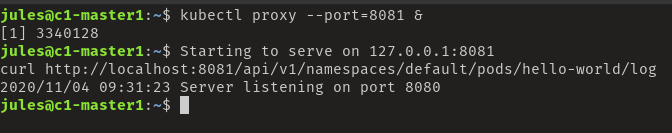

# API Request
L'API Server de Kubernetes est une API Rest, ce qui veux dire que chaque commande kubectl est converti en requête.

Cela veux également dire, que n'importe quel client HTTP peux communiquer avec l'API Server (curl, POSTMAN). Pratique pour développer son propre outil.

L'API Server dispose des VERB HTTP:
* GET
* POST
* PUT
* PATCH
* DELETE

Mais également de requête spéciales:
* LOG
* EXEC
* WATCH

## API Resource Location (API Paths)
Lien générique permettant de trouver l'emplacement d'une ressource.

### Core API (Legacy)
```bash
http://apiserver:port/api/$VERSION/$RESOURCE_TYPE
http://apiserver:port/api/$VERSION/namespaces/$NAMESPACE/$RESOURCE_TYPE/$RESOURCE_NAME
```
### API Groups
```bash
http://apiserver:port/apis/$GROUPNAME/$VERSION/$RESOURCE_TYPE
http://apiserver:port/apis/$GROUPNAME/$VERSION/namespaces/$NAMESPACE/$RESOURCE_TYPE/$RESOURCE_NAME
```

## API Responde Code
Code HTTP de réponse (classique, un coup de refresh n'est jamais de trop)



## Contenue d'une requête HTTP avec l'API Server




## Command
Pour tester les requête HTTP il faut d'abord créer un pod.

Créer le fichier suivant nommé "pod.yaml"
```yaml
apiVersion: v1
kind: Pod
metadata:
  name: hello-world
spec:
  containers:
  - name: hello-world
    image: gcr.io/google-samples/hello-app:1.0
```

```bash
#Creating the pod from the pod.yaml file
kubectl apply -f pod.yaml
# Get a list of our currently running pod
kubectl get pod hello-world
```
```bash
#Increase the verbosity
#Display requested resource URL. Focus on VERB, API Path and Response code
kubectl get pod hello-world -v 6

#Same output as 6, add HTTP Request Headers. Focus on application type, and User-Agent
kubectl get pod hello-world -v 7 

#Same output as 7, adds Response Headers and truncated Response Body.
kubectl get pod hello-world -v 8 

#Same output as 8, add full Response. Focus on the bottom, look for metadata
kubectl get pod hello-world -v 9 
```

Testons avec la requête CURL.

Mais pour que la requête aboutisse il faut être authentifié, pour cela ont ajoute la commande "kubectl proxy", afin de la contourner.

```bash
#Create a proxy with a unused port, and add the path of our API "/api/v1/namespaces/default/pods/hello-world"
kubectl proxy --port=8081 & 
curl -k http://localhost:8081/api/v1/namespaces/default/pods/hello-world
```



### Watch
```bash
#A watch on Pods will watch on the resourceVersion on api/v1/namespaces/default/Pods
kubectl get pods --watch -v 6 &

#We can see kubectl keeps the TCP session open with the server...waiting for data.
netstat -plant | grep kubectl

#Delete the pod and we see the updates are written to our stdout. Watch stays, since we're watching All Pods in the default namespace.
kubectl delete pods hello-world

#But let's bring our Pod back
kubectl apply -f pod.yaml

#And kill off our watch
fg
ctrl+c
```

### Logs
```bash
#Accessing logs
kubectl logs hello-world
kubectl logs hello-world -v 6

#Start kubectl proxy, we can access the resource URL directly.
kubectl proxy --port=8081 &
curl http://localhost:8081/api/v1/namespaces/default/pods/hello-world/log 

#Kill our kubectl proxy, fg then ctrl+c
fg
ctrl+c
```



### Authentication failure
```bash
#Authentication failure Demo
cp ~/.kube/config  ~/.kube/config.ORIG

#Make an edit to our username changing user: kubernetes-admin to user: kubernetes-admin
vi ~/.kube/config

#Try to access our cluster, and we see GET https://172.16.94.10:6443/api?timeout=32s 403 Forbidden in 5 milliseconds
#enter in incorrect information for username and password
kubectl get pods -v 6

#Let's put our backup kubeconfig back
cp ~/.kube/config.ORIG ~/.kube/config

#Test out access to the API Server
kubectl get pods 

#Missing resources, we can see the response code for this resources is 404...it's Not Found.
kubectl get pods nginx-pod -v 6

#Let's look at creating and deleting a deployment. 
#We see a query for the existence of the deployment which results in a 404, then a 201 OK on the POST to create the deployment which suceeds.
kubectl apply -f deployment.yaml -v 6

#Get a list of the Deployments
kubectl get deployment 

#Clean up when we're finished. We see a DELETE 200 OK and a GET 200 OK.
kubectl delete deployment hello-world -v 6
kubectl delete pod hello-world
```