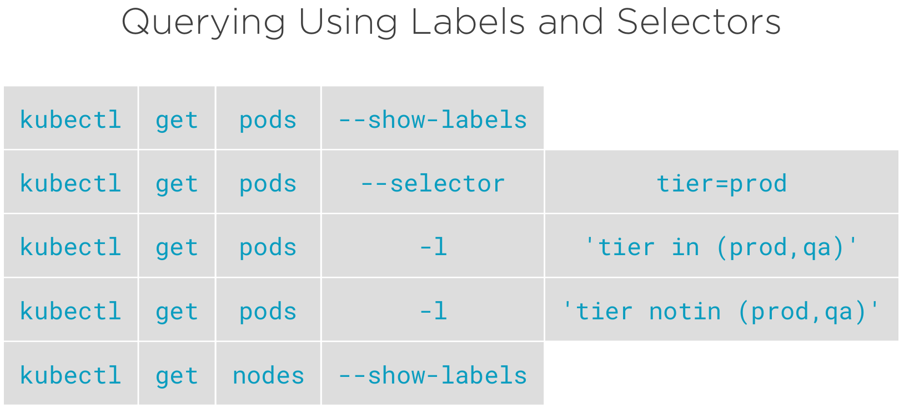

# Labels
Les labels sont utilisé pour organiser des resources :
* Used to organize resources - Pods, Nodes and more
* Label Selectors are used to select/query Objects
* Return collections of Objects that satisfy search conditions
* Enables you to perform operations on a collection of resources...like Pods
* Influence internal operations of Kubernetes

What is a label ?
* Non-hierarchical, key/value pair
* Object can have more than one label per resource
* Enables more complex representations of state and ability to query
* Keys can be 63 characters or less
* Values can be 253 characters or less

Comment utiliser des labels
* Creating resources with Labels
  * Imperatively with kubectl
  ```bash
  #Add a label to a resource
  kubectl label pod nginx tier=PROD app=v1
  #Modify a label
  kubectl label pod nginx tier=DEBUG app=v1 --overwrite
  #Remove a label from a resource
  kubectl label pod nginx app-
  ```
  * Declaratively in a Manifest in YAML
  ```yaml
  apiVersion: v1
  kind: Pod
  metadata:
    name: nginx
    labels
      app: v1
      tier: PROD
  spec:
    ...
  ```
* Editing existing resources’ Labels
  * Assign (add) a new Label
  * Overwriting an existing Label




Comment Kubernetes utilise les labels
* Controllers and Services match Pods using selectors
* Influencing Pod Scheduling
* Scheduling to specific Nodes - permet de définir un label pour que le service associé soit déployé uniquement sur une node
* Special hardware (SSD or GPU)
* Using a label selector

## Définir des fichiers de déploiement et de service

Il est important que les "run" soit le même dans le "matchLabels" et dans le "metadata"
```yaml
kind: Deployment
...
spec:
  selector:
    matchLabels:
      run: hello-world
...
  template:
    metadata:
      labels:
        run: hello-world
    spec:
      containers:
...
```

Idem, il est important que le "selector" comporte le même label
```yaml
kind: Service
...
spec:
  selector:
    run: hello-world
  ports:
  - port: 80
    protocol: TCP
    targetPort: 8080
```

## Commands
Créer une fichier 'CreatePodsWithLabels.yaml'
```yaml
apiVersion: v1
kind: Pod
metadata:
  name: nginx-pod-1
  labels: 
    app: MyWebApp
    deployment: v1
    tier: prod
spec:
  containers:
  - name: nginx
    image: nginx
    ports:
    - containerPort: 80
---
apiVersion: v1
kind: Pod
metadata:
  name: nginx-pod-2
  labels: 
    app: MyWebApp
    deployment: v1.1
    tier: prod
spec:
  containers:
  - name: nginx
    image: nginx
    ports:
    - containerPort: 80
---
apiVersion: v1
kind: Pod
metadata:
  name: nginx-pod-3
  labels: 
    app: MyWebApp
    deployment: v1.1
    tier: qa
spec:
  containers:
  - name: nginx
    image: nginx
    ports:
    - containerPort: 80
---
apiVersion: v1
kind: Pod
metadata:
  name: nginx-pod-4
  labels: 
    app: MyAdminApp
    deployment: v1
    tier: prod
spec:
  containers:
  - name: nginx
    image: nginx
    ports:
    - containerPort: 80
---
```

```bash
#Create a collection of pods with labels assinged to each
cat CreatePodsWithLabels.yaml
kubectl apply -f CreatePodsWithLabels.yaml
```

```bash
#Look at all the Pod labels in our cluster
kubectl get pods --show-labels

#Look at one Pod's labels in our cluster
kubectl describe pod nginx-pod-1 | head

#Query labels and selectors
kubectl get pods --selector tier=prod
kubectl get pods --selector tier=qa
kubectl get pods -l tier=prod
kubectl get pods -l tier=prod --show-labels

#Selector for multiple labels and adding on show-labels to see those labels in the output
kubectl get pods -l 'tier=prod,app=MyWebApp' --show-labels
kubectl get pods -l 'tier=prod,app!=MyWebApp' --show-labels
kubectl get pods -l 'tier in (prod,qa)'
kubectl get pods -l 'tier notin (prod,qa)'

#Output a particluar label in column format
kubectl get pods -L tier
kubectl get pods -L tier,app
```

```bash
#Edit an existing label
kubectl label pod nginx-pod-1 tier=non-prod --overwrite

#Adding a new label
kubectl label pod nginx-pod-1 another=Label

#Removing an existing label
kubectl label pod nginx-pod-1 another-

#Performing an operation on a collection of pods based on a label query
kubectl label pod --all tier=non-prod --overwrite

#Delete all pods matching our non-prod label
kubectl delete pod -l tier=non-prod
```

Un exemple plus complexe, création de deux fichiers: 

deployment-label.yaml
```yaml
apiVersion: apps/v1
kind: Deployment
metadata:
  name: hello-world
  labels:
    app: hello-world
spec:
  replicas: 4
  selector:
    matchLabels:
      app: hello-world
  template:
    metadata:
      labels:
        app: hello-world
    spec:
      containers:
      - name: hello-world
        image: gcr.io/google-samples/hello-app:1.0
        ports:
        - containerPort: 8080
```

et service.yaml
```yaml
apiVersion: v1
kind: Service
metadata:
  name: hello-world
spec:
  ports:
  - port: 80
    protocol: TCP
    targetPort: 8080
  selector:
    app: hello-world
```

### Kubernetes Resource Management
```bash
#Start a Deployment with 4 replicas
kubectl apply -f deployment-label.yaml

#Expose our Deployment as Service
kubectl apply -f service.yaml

#Look at the Labels and Selectors on each resource, the Deployment, ReplicaSet and Pod
#The deployment has a selector for app=hello-world
kubectl describe deployment hello-world

#The ReplicaSet has labels and selectors for app and the current pod-template-hash
#Look at the Pod Template and the labels on the Pods created
kubectl describe replicaset hello-world

#The Pods have labels for app=hello-world and for the pod-template-hash of the current ReplicaSet
kubectl get pods --show-labels

#Edit the label on one of the Pods in the ReplicaSet, change the pod-template-hash
kubectl label pod PASTE_POD_NAME_HERE pod-template-hash=DEBUG --overwrite

#The ReplicaSet will deploy a new Pod to satisfy the number of replicas. Our relabeled Pod still exists.
kubectl get pods --show-labels
```
### Remove a pod from load balancing
```bash
#Let's look at how Services use labels and selectors, check out services.yaml
kubectl get service

#The selector for this serivce is app=hello-world, that pod is still being load balanced to!
kubectl describe service hello-world 

#Get a list of all IPs in the service, there's 5...why?
kubectl describe endpoints hello-world

#Get a list of pods and their IPs
kubectl get pod -o wide

#To remove a pod from load balancing, change the label used by the service's selector.
#The ReplicaSet will respond by placing another pod in the ReplicaSet
kubectl get pods --show-labels
kubectl label pod PASTE_POD_NAME_HERE app=DEBUG --overwrite

#Check out all the labels in our pods
kubectl get pods --show-labels

#Look at the registered endpoint addresses. Now there's 4
kubectl describe endpoints hello-world

#To clean up, delete the deployment, service and the Pod removed from the replicaset
kubectl delete deployment hello-world
kubectl delete service hello-world
kubectl delete pod PASTE_POD_NAME_HERE
```

### Scheduling a pod to a node
Just before, create the file PodsToNodes.yaml
```yaml
apiVersion: v1
kind: Pod
metadata:
  name: nginx-pod-ssd
spec:
  containers:
  - name: nginx
    image: nginx
    ports:
    - containerPort: 80
  nodeSelector:
    disk: local_ssd
---
apiVersion: v1
kind: Pod
metadata:
  name: nginx-pod-gpu
spec:
  containers:
  - name: nginx
    image: nginx
    ports:
    - containerPort: 80
  nodeSelector:
    hardware: local_gpu
---
apiVersion: v1
kind: Pod
metadata:
  name: nginx-pod
spec:
  containers:
  - name: nginx
    image: nginx
    ports:
    - containerPort: 80
```

```bash
#Scheduling is a much deeper topic, we're focusing on how labels can be used to influence it here.
kubectl get nodes --show-labels 

#Label our nodes with something descriptive
kubectl label node c1-node1 disk=local_ssd
kubectl label node c1-node2 hardware=local_gpu

#Query our labels to confirm.
kubectl get node -L disk,hardware

#Create three Pods, two using nodeSelector, one without.
cat PodsToNodes.yaml
kubectl apply -f PodsToNodes.yaml

#View the scheduling of the pods in the cluster.
kubectl get node -L disk,hardware
kubectl get pods -o wide

#Clean up when we're finished, delete our labels and Pods
kubectl label node c1-node1 disk-
kubectl label node c1-node2 hardware-
kubectl delete pod nginx-pod
kubectl delete pod nginx-pod-gpu
kubectl delete pod nginx-pod-ssd
```