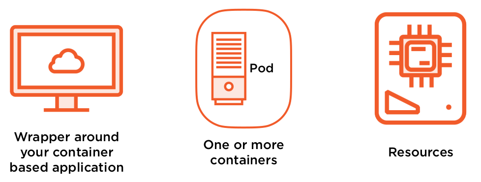
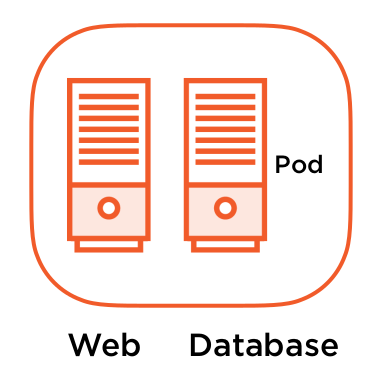
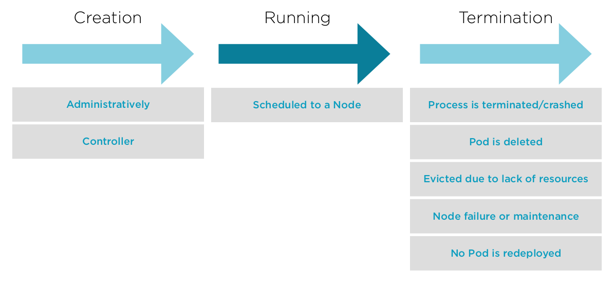
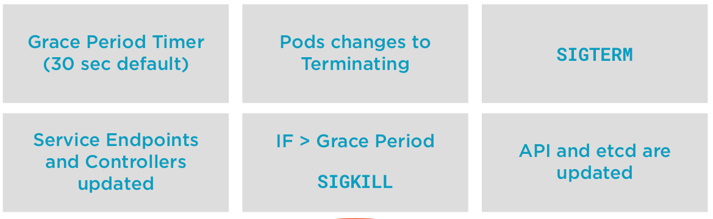
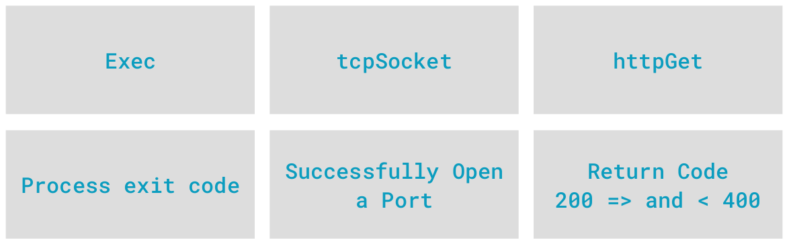

# What is a pod ?



* Unit of scheduling
  * Allocating work - by the scheduler in the node
  * A process that’s running in your cluster - when is up and consuming resources

* Unit of deployment
  * Inside your application configuration
  * Resources associated - Networking and Storage

Le pod permet une abstraction par dessus le management des conteneurs (au niveau de la configuration des resources et du réseau).

## Comment les pods manipules les conteneurs
Deux grandes familles:
* [Single Container Pods](6_1_Single_Pods.md)
  * Single application inside a container deployed in our cluster
  * Most common deployment
  * Generally a single process running in a container
  * Often leads to easier application scaling
  * "Is a pod running a container running a single process on a node in our cluster"
* [Multi-containers Pods](6_2_Multi_Pods.md)
  * More than one container wrapped up in a pod
  * For very tightly coupled applications - producer/ consumer relationship
  * Scheduling processes together
  * Requirement on some shared resource
  * Usually something generating data while the other process consumes
  * __Don’t__ use this to influence scheduling, we use other techniques for that! (labels, node selector)

## Relationship between Controllers and Pods
* Controllers have the responsability to keep your apps in the desired state
* Responsible for starting and stopping Pods - based on configuration
* Application scaling - if you have the resources
* Application recovery - if a pod goes offline or becomes unavailable, Kubernetes make sure you have the correct number of pods up and running
* You __DON'T__ want to run bare/naked Pods - bare/naked pod, is a pod deployed without controller (deployment, replica set, deamon set, etc...)
  * Because they won’t be recreated in the event of a failure

### Working with Pods - kubectl

```bash
kubectl exec -it POD1 --container CONTAINER1 -- /bin/bash
kubectl port-forward pod POD1 LOCALPORT:CONTAINERPORT
```

## Common anti-pattern for multi-container Pods
Attention lors de la création d'un pods avec plusieurs conteneurs.

Nous ne voulons pas d'un Pod avec un conteneur web & DB.

Cela peut paraître une bonne idée (échange de donnée rapide). Mais cela pose de 2 soucis majeurs:
* Récupération - Si un pod meurs quels sont mes choix entre un service web stateless et une bdd statefull, quel controller utiliser ?
* Limits Scaling - comme les conteneurs sont liés si j'ai besoin uniquement d'un serveur web en plus, une BDD sera également déployée.



## Shared Resources Inside a Pod

### Networking
Containers in a pod share the same Linux operating system-level namespace. This isn't the same Kubernetes namespace. Since they share the same network namespace, to be able to communicate with each other.

* Shared loopback interface, used for communication over localhost
* Be mindful of application port conflicts

### Storage

* Each container image has it’s own file system
* Volumes are defined at the Pod level
* Shared amongst the containers in a Pod
* Mounted into the containers’ file system
* Common way for containers to exchange data

## Pod Lifecycle



## Stopping/Terminating Pods



```bash
#Change the grace-period for a specific pod
kubectl delete pod --grace-period=<second>
```

In some scenarios where you might need to specify the force deletion of a pod, which immediately delete the records in the API Server and etcd. It might not be able to shut down the actual application itself. The value of this is by ripping out the metadata about the pod resource that's up and running is that, well, you've kind of abandoned that pod, deleted the metadata, but you can now go and recreate that pod if you needed it to be the same name. Otherwise you have a naming conflict and this pod kind of hanging on that you conldn't delete.

So, forced deletion deletes the metadata. It might leave that process up running, so you will have to go clean that up if it didn't clean itself up.
```bash
# Force deletion - Immediately deletes records in API an etcd
kubectl delete pod --grace-period=0 --force
```

## Persistency of Pods

* A Pod is never redeployed
* If a Pod stops, a new one is created based on its Controller - no state transition between the previous execution
* Go back to the original container image(s) in the Pod definition

How do we deal with things like application configuration or application statefull ?

* Configuration is managed externally
  * Pod Manifests, secrets and ConfigMaps - Passwords, connexionStrings :arrow_right: stored in the cluster
  * Passing environment variables into containers
* Data Persistency is managed externally
  * PersistentVolume
  * PersistentVolumeClaim

## Container Restart Policy

* A container in a Pod can restart independent of the Pod
* Applies to containers inside a Pod and defined inside the Pod’s Spec
* The Pod is the environment the container runs in
* Not rescheduled to another Node, but restarted by the Kubelet on that Node
* Restarts with an exponential backoff, 10s, 20s, 40s capped at 5m and reset to 0 after 10m of successful runtime

Containers restart policy has 3 different configuration:
* Always (default) - will restart all containers inside a Pod
* OnFailure - Non-graceful termination
* Never

How to configure it
```yaml
apiVersion: v1
kind: Pod
metadata:
  name: nginx-pod
spec:
  containers:
  - name: nginx
    image: nginx
  restartPolicy: OnFailure
```

## Commands

Let's create a file nammed 'pod.yaml'
```yaml
apiVersion: v1
kind: Pod
metadata:
  name: hello-world-pod
spec:
  containers:
  - name: hello-world
    image: gcr.io/google-samples/hello-app:1.0
    ports:
    - containerPort: 80
```

and 'pod-restart-policy.yaml'
```yaml
apiVersion: v1
kind: Pod
metadata:
  name: hello-world-onfailure-pod
spec:
  containers:
  - name: hello-world
    image: gcr.io/google-samples/hello-app:1.0
  restartPolicy: OnFailure
---
apiVersion: v1
kind: Pod
metadata:
  name: hello-world-never-pod
spec:
  containers:
  - name: hello-world
    image: gcr.io/google-samples/hello-app:1.0
  restartPolicy: Never
```

```bash
#Start up kubectl get events --watch and background it.
kubectl get events --watch &
clear

#Create a pod...we can see the scheduling, container pulling and container starting.
kubectl apply -f pod.yaml

#We've used exec to launch a shell before, but we can use it to launch ANY program inside a container.
#Let's use killall to kill the hello-app process inside our container
kubectl exec -it hello-world-pod -- /bin/sh 
ps
exit

#We still have our kubectl get events running in the background, so we see if re-create the container automatically.
kubectl exec -it hello-world-pod -- /usr/bin/killall hello-app

#Our restart count increased by 1 after the container needed to be restarted.
kubectl get pods

#Look at Containers->State, Last State, Reason, Exit Code, Restart Count and Events
#This is because the container restart policy is Always by default
kubectl describe pod hello-world-pod

#Cleanup time
kubectl delete pod hello-world-pod

#Kill our watch
fg
ctrl+c
```

```bash
#Remember...we can ask the API server what it knows about an object, in this case our restartPolicy
kubectl explain pods.spec.restartPolicy

#Create our pods with the restart policy
more pod-restart-policy.yaml
kubectl apply -f pod-restart-policy.yaml

#Check to ensure both pods are up and running, we can see the restarts is 0
kubectl get pods 

#Let's kill our apps in both our pods and see how the container restart policy reacts
kubectl exec -it hello-world-never-pod -- /usr/bin/killall hello-app
kubectl get pods

#Review container state, reason, exit code, ready and contitions Ready, ContainerReady
kubectl describe pod hello-world-never-pod

#let's use killall to terminate the process inside our container. 
kubectl exec -it hello-world-onfailure-pod -- /usr/bin/killall hello-app

#We'll see 1 restart on the pod with the OnFailure restart policy.
kubectl get pods 

#Let's kill our app again, with the same signal.
kubectl exec -it hello-world-onfailure-pod -- /usr/bin/killall hello-app

#Check its status, which is now Error too...why? The backoff.
kubectl get pods 

#Let's check the events, we hit the backoff loop. 10 second wait. Then it will restart.
#Also check out State and Last State.
kubectl describe pod hello-world-onfailure-pod 

#Check its status, should be Running...after the Backoff timer expires.
kubectl get pods 

#Now let's look at our Pod statuses
kubectl delete pod hello-world-never-pod
kubectl delete pod hello-world-onfailure-pod
```

## Defining Pod Health

* A Pod is considered ready when all containers are "running"
* But we’d like to be able to understand a little more about our applications
* We can add additional intelligence to our
* Pod’s state and health
* Container Probes
  * livenessProbe
    * Runs a diagnostic check on a container
    * Per container setting
    * On failure, the Kubelet restarts the container
    * Container Restart Policy
    * Give Kubernetes a better understanding of our application
  * readinessProbe
    * Runs a diagnostic check on the container
    * Per container setting
    * On startup, your application won’t receive traffic until ready (until the readinessProbe have success)
    * On failure, removes Pod from load balancing or replication controller (the container is not restarted)
    * For applications have long startup times
    * Prevents users from seeing errors

### What type of checks ?


3 types de checks:
* Exec
  * Execute une ligne dans le conteneurs et regarde le code de sortie de ce process
* tcpSocker
  * Regarde si un port est ouvert (pour lancer un outil de diagnostique, ou port d'un programme)
* httpGet
  * Fait une requête URL et regarde le code http de sortie

3 types d'erreurs en sortie:
* Success
  * Réussite du processus
* Failure
  * Erreur d'un test sur le conteneur
* Unknown
  * Erreur lié au processus du diagnostique

### Configure Container Probes

* initialDelaySeconds - number of seconds after the container has started before running container probes
* periodSeconds - interval when the test probe are execute, default 10 seconds
* timeoutSeconds - number of seconds the prode test before giving up
* failureThreshold - number of missed checks before reporting failure, default 3
* successThreshold - number of probes to be considered successful and live, default 1

### livenessProbe
```yaml
spec:
  containers:
    ...
    livenessProbe:
      tcpSocket:
        port: 8080
      initialDelaySeconds: 15
      periodSeconds: 20
```

### readinessProbe
```yaml
spec:
  containers:
    ...
    readinessProbe:
      tcpSocket:
        port: 8080
      initialDelaySeconds: 5
      periodSeconds: 10
```

### Commands
Create file container-probes.yaml
```yaml
apiVersion: apps/v1
kind: Deployment
metadata:
  name: hello-world
spec:
  replicas: 1
  selector:
    matchLabels:
      app: hello-world
  template:
    metadata:
      labels:
        app: hello-world
    spec:
      containers:
      - name: hello-world
        image: gcr.io/google-samples/hello-app:1.0
        ports:
        - containerPort: 8080
        livenessProbe:
          tcpSocket:
            port: 8081
          initialDelaySeconds: 10
          periodSeconds: 5
        readinessProbe:
          httpGet:
            path: /
            port: 8081
          initialDelaySeconds: 10
          periodSeconds: 5
```

```bash
#Start a watch to see the events associated with our probes.
kubectl get events --watch &
clear

#We have a single container pod app, in a Deployment that has both a liveness probe and a readiness probe
cat container-probes.yaml

#Send in our deployment, after 10 seconds, our liveness and readiness probes will fail.
#The liveness probe will kill the current pod, and recreate one.
kubectl apply -f container-probes.yaml

#kill our watch
fg
ctrl+c

#We can see that our container isn't ready 0/1 and it's Restarts are increasing.
kubectl get pods

#Let's figure out what's wrong
#1. We can see in the events. The Liveness and Readiness probe failures.
#2. Under Containers, Liveness and Readiness, we can see the current configuration. And the current probe configuration. Both are pointing to 8081.
#3. Under Containers, Ready and Container Contidtions, we can see that the container isn't ready.
#4. Our Container Port is 8080, that's what we want our probes, probings. 
kubectl describe pods

#So let's go ahead and change the probes to 8080
vi container-probes.yaml

#And send that change into the API Server for this deployment.
kubectl apply -f container-probes.yaml

#Confirm our probes are pointing to the correct container port now, which is 8080.
 
#Let's check our status, a couple of things happened there.
#1. Our Deployment ReplicaSet created a NEW Pod, when we pushed in the new deployment configuration.
#2. It's not immediately ready because of our initialDelaySeconds which is 10 seconds.
#3. If we wait long enough, the livenessProbe will kill the original Pod and it will go away.
#4. Leaving us with the one pod in our Deployment's ReplicaSet
kubectl get pods 

kubectl delete deployment hello-world
```