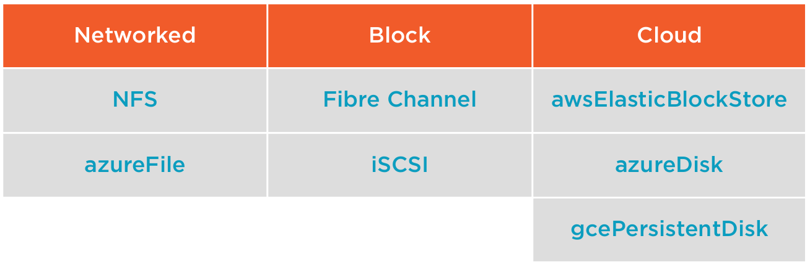
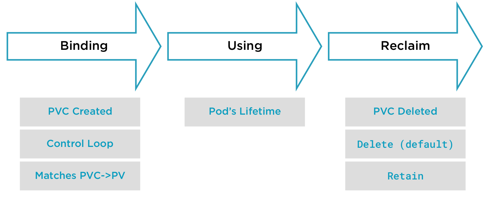

# Persistent storage

Ce que nous savons actuellement sur les conteneurs:
* les conteneurs sont éphémères
* Les données écritent dans un conteneur sont détruites lors de sa suppression
* Quand un Pod est supprimé, les conteneurs sont supprimés de la Node
* Comment pouvons nous persisté de la données entre les différents cycle de vie des Pods ?

## Storage API Object
Kubernetes nous donne des objects permettant de persisté de la donnée:
* Volume - Stockage persistant qui devient une part du pod (dans les specs)
* Persistent Volume - Stockage de la donnée en elle même, stockage pour les pods utilisé dans le cluster
* Persistent Volume Claim - Demande faite par un utilisateur de persister un volume
* Storage Class - Un moyen de créer des groupes ou classes de stockage disponible dans le cluster

## Volume 
* Persistent storage deployed as part of the Pod spec
* Implementation details for your storage
* This can be challenging...
  * Sharing code (very restritive with the Pod itself)
  * Same lifecycle as Pod
* We can do better...

## Persistent Volumes
* Administrator defined storage in the Cluster
  * Is the responsibility of the cluster administrator to create and delete storage
  * This is going to be an API object that represents the actual storage itself
* Implementation details for your storage
* Lifecycle independent of the Pod
* Managed by the Kubelet
  * Maps the storage in the Node
  * Exposes Persitent Volume as a mount inside the container - like any other Linux device

For more details https://kubernetes.io/docs/concepts/storage/persistent-volumes/

### Types of Persistent Volumes
For simplify the different types of persistent volumes:

It isn't an exhaustive list, a more complete list is available here: https://kubernetes.io/docs/concepts/storage/persistent-volumes/#types-of-persistent-volumes

## Persistent Volumes Claim

* A request for storage by a user - is a resquest to the cluster for some amount of storage
  * Size
  * Access Mode - specific node, read-only /read-write
  * Storage Class
* Enable portability of your application configurations
* The Cluster will map a PVC to a PV

## Access Mode
In PV & PVC we'll need to define an access mode. Wich controls how a node (or multiple nodes) access a PV.

Because a PV & PVC are mapped to the Node by the kubelet and the exposed into a Pod.

They are 3 access modes:
* ReadWriteOnce (RWO)
  * One Node can mount a volume for read & write access
* ReadWriteMany (RWX)
  * More than one Node can be access to the volume for read & write access 
* ReadOnlyMany (ROX)
  * More than one Node can be access to the volume for readOnlyAccess

The volumes are __Node level access__, not Pod level access

## Static Provisioning Workflow

* Define a persistent volume - detail for access (ex: NFS, server adress), the size in the spec
* Define a persistent volume claim - is the resquest for storage in the cluster - define the size, access mode and storage class
* Define Volume in Pod spec

## Storage Lifecycle

