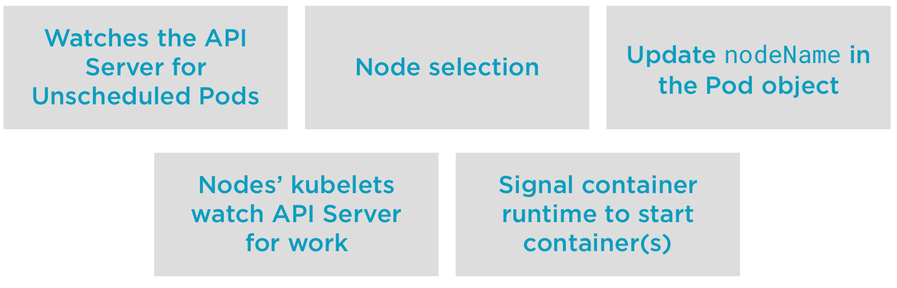

# Scheduling

Scheduling inside Kubernetes, is the part of the master Node (he has the responsibility for scheduling workload).

### Kubernetes has one job...
### starting Pods on Nodes

But to so this, a lot of decisions have to be made (enough resources, policies in the cluster).

## Scheduling in Kubernetes
Scheduler is the process of selecting a node to start a Pod on inside of our Clutser
* Selecting a Node to start a Pod on - one of the core components in the master node
* kube-scheduler - this is the default scheduler
* you can create our own scheduler

## The goal of Scheduling
Is find the best, most feasible node in the cluster to run a pod.

To make this decisions, he have two things:
* Resources - cpu, memory, storage
* Policy - ex: two Pod on different nodes or zones

## Scheduling Process



## Node Selection
Let's look more closely on the node selection process.

The node selection have 3 phases:
* Filetering - remove node that cannot run our pod
  * From all the nodes
  * Apply filters
  * Filtered Nodes
  * Hard constraints - pod spec, node resources, etc...
  * If no node is found, the pod is unscheduable and will fail scheduling
* Scoring - process of yielding a list of eligible nodes
  * Scoring function - Start from the filtered list
  * Feasible Nodes
  * Policu constraints - image on the node, etc...
  * Find the best node to run our pod
* Binding - updating the node name in our pods object
  * Selected Nodes List - the highest priority nodes
  * Ties are broken - if they are multiple nodes, a random was selected
  * Update API Object

## Resources Request
Resource are important in the process of shoosing a node

* Setting requests will cause the scheduler to find a Node to fit the workload/Pod
  * requests are guarantees
  * CPU
  * Memory
* Allocatable resources per Node
* Pods that need to be scheduled but there not enough resources available will go Pending

## Demo 1

Finding scheduling information
```bash
#Let's create a deployment with three replicas
kubectl apply -f deployment.yaml

#Pods spread out evenly across the Nodes due to our scoring functions for selector spread during Scoring.
kubectl get pods -o wide

#We can look at the Pods events to see the scheduler making its choice
kubectl describe pods 

#If we scale our deployment to 6...
kubectl scale deployment hello-world --replicas=6

#We can see that the scheduler works to keep load even across the nodes.
kubectl get pods -o wide

#We can see the nodeName populated for this node
kubectl get pods hello-world-[tab][tab] -o yaml

#Clean up this demo...and delete its resources
kubectl delete deployment hello-world
```

## Demo 2

Scheduling Pods with resource requests. 
```bash
#Start a watch, the pods will go from Pending->ContainerCreating->Running
#Each pod has a 1 core CPU request.
kubectl get pods --watch &
kubectl apply -f requests.yaml

#We created three pods, one but one is not starting...
kubectl get pods -o wide

#Let's scale our deployment to 6 replica.  These pods will stay pending.  Some pod names may be repeated.
kubectl scale deployment hello-world-requests --replicas=6

#We see that three Pods are pending...why?
kubectl get pods -o wide
kubectl get pods -o wide | grep Pending

#Let's look at why the Pod is Pending...check out the Pod's events...
kubectl describe pods

#Now let's look at the node's Allocations...we've allocated 62% of our CPU...
#1 User pod using 1 whole CPU, one system Pod using 250 millicores of a CPU and 
#looking at allocatable resources, we have only 2 whole Cores available for use.
#The next pod coming along wants 1 whole core, and tha'ts not available.
#The scheduler can't find a place in this cluster to place our workload...is this good or bad?
kubectl describe node c1-node1

#Clean up after this demo
kubectl delete deployment hello-world-requests

#stop the watch
fg
ctrl+c
```