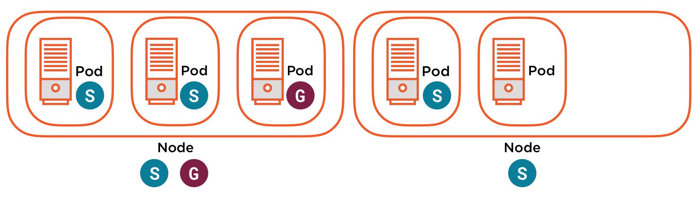

# Node Selector

Node selector make a scheduling decision to place a pod on a subset of nodes.

* nodeSelector - assign Pods to Nodes using Labels and Selectors
* Apply Labels to Nodes
* Scheduler will assign Pods a to a Node with a matching Label
* Simple key/value check based on matchLabels
* Often used to map Pods to Nodes based on...
  * Special hardware requirements
  * Workload isolation

## Scheduling



They are two Nodes, one with labels S and G, and one with just label S.

* If I create a pod with label S, the pod is scheduled normally.
* If I create a pod with label G, the pod is scheduled only is the first node
* If I create a pod with no label, the pod is scheduled normally
* If I create a pod with a label R, the pod is __not__ scheduled and pending, because the label is a requirement spec in the pod

## Assigning Pods to Nodes using Node Selectors

They are two steps

Assign a label to a node
```bash
kubectl label node c1-node2 hardware=local_gpu
```

Inside the pod specs
```yaml
spec:
    containers:
    - name: hello-world
      image: gcr.io/google-samples/hello-app:1.0
      ports:
      - containerPort: 8080
    nodeSelector:
      hardware: local_gpu
```

# Demo

Checks [labels](../2_management_APIServer_&_Pod/5_2_Labels.md) for more information